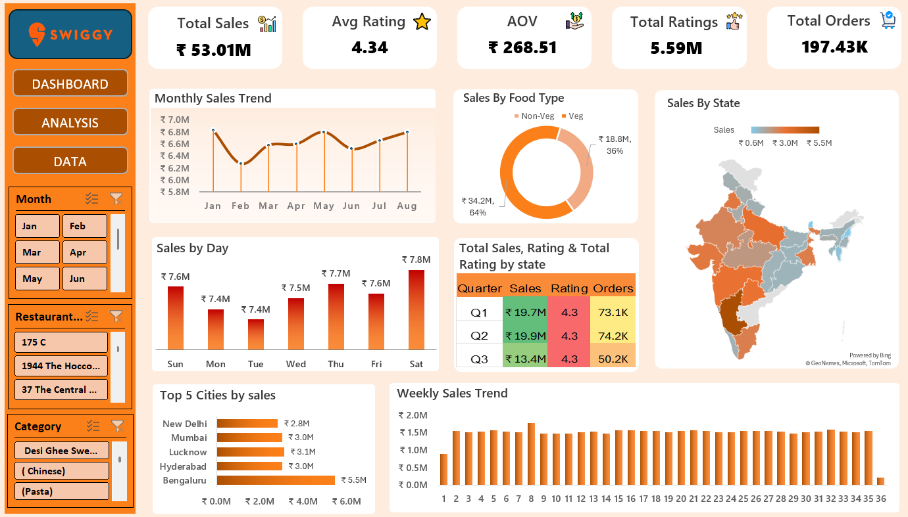

# Swiggy Sales & Order Analysis

An exploratory data analysis project focused on understanding sales performance, order patterns, and business trends using Microsoft Excel and Power Query.

## Project Overview

This project analyzes Swiggy sales and order data from January 2025 to August 2025.

The analysis focuses on identifying sales trends, customer order patterns, food category performance, and geographical contribution.

## Tools Used

- Microsoft Excel
- Power Query
- Pivot Tables
- Data Visualization

## Analysis Performed

- Monthly sales trends
- Weekly sales trends
- Veg vs Non-Veg sales performance
- State-wise sales contribution
- Top cities by sales
- Weekday vs Weekend performance
- Quarterly sales, ratings, and order analysis

## Dashboard

The project includes an Excel dashboard that summarizes key sales and order metrics.



## Key Findings

- Total sales reached **₹53.01M** across the analyzed period.
- The dataset recorded approximately **197.43K orders** with an average order value of **₹268.51**.
- Non-Veg sales contributed approximately **64%** of total sales, compared with **36%** from Veg sales.
- Among the top five cities analyzed, **Bengaluru** recorded the highest sales contribution at approximately **₹5.5M**.
- **Saturday** recorded the highest daily sales among the days shown, at approximately **₹7.8M**.
- Sales remained relatively consistent across the analyzed months, with monthly sales generally ranging between approximately **₹6.3M and ₹6.8M**.

## Business Recommendations

- Focus on high-performing Non-Veg categories while maintaining a balanced Veg offering.
- Prioritize weekend promotions and operational capacity based on stronger Saturday sales.
- Analyze customer behavior in high-performing cities such as Bengaluru to identify opportunities for targeted campaigns.
- Monitor monthly sales fluctuations to identify factors affecting lower-performing periods.

## Project Files

- [Excel Analysis Workbook](Swiggy_Sales_Order_Analysis.xlsx)
- [Dashboard Preview](images/dashboard.png)

## Project Structure

```text
swiggy-sales-order-analysis/
│
├── images/
│   └── dashboard.png
│
├── README.md
│
└── Swiggy_Sales_Order_Analysis.xlsx
